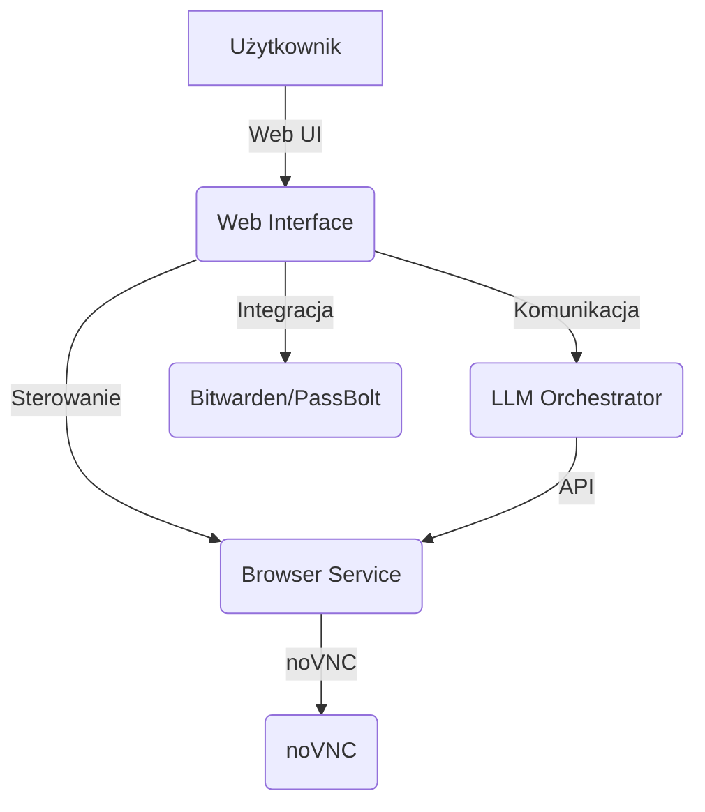
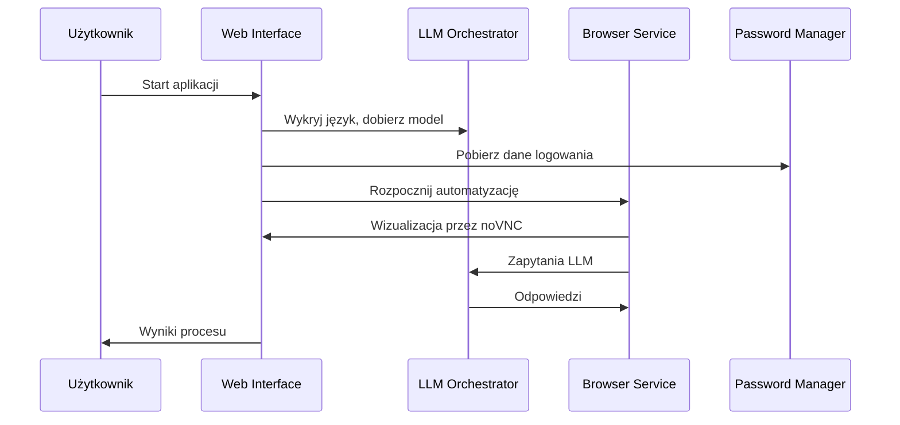
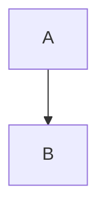

# coBoarding


*Diagram architektury systemu (Mermaid)*

coBoarding to kompleksowy, kontenerowy system do automatycznego wypełniania formularzy rekrutacyjnych, kładący nacisk na prywatność, elastyczność oraz wsparcie wielojęzyczne.

---

## Szybki start

### Wymagania wstępne
- Python 3.11+ lub 3.12
- Docker i Docker Compose v2

### Pierwsze uruchomienie na Ubuntu/Debian

```bash
git clone https://github.com/coboarding/python.git
cd python
bash install.sh  # automatyczna instalacja zależności i Docker Compose v2 (Ubuntu/Debian)
bash run.sh      # lub ./run.ps1 na Windows
```

> **WAŻNE:** Skrypt install.sh jest przeznaczony dla systemów Ubuntu/Debian (używa apt-get). Na innych dystrybucjach Linuksa (np. Fedora, Arch, CentOS, Alpine) należy samodzielnie zainstalować: Python 3.11+, pip, venv, Docker i Docker Compose v2.

### Pierwsze uruchomienie na Windows

```powershell
git clone https://github.com/coboarding/python.git
cd python
./install.ps1   # instalacja zależności i środowiska (PowerShell)
./run.ps1       # uruchomienie systemu (PowerShell)
```

Pierwsze uruchomienie automatycznie skonfiguruje środowisko (venv, zależności, kontenery, Docker Compose v2).

---


*Diagram przepływu działania (Mermaid)*

## Jak to działa

coBoarding automatyzuje proces aplikowania na portale pracy:
1. **Wykrywa sprzęt** i dobiera model LLM
2. **Konfiguruje środowisko** (Docker, Python, cache pip)
3. **Uruchamia Web UI** (HTTPS, obsługa głosowa, noVNC)
4. **Wykrywa język formularza** (PL, DE, EN)
5. **Integruje się z menedżerami haseł** (Bitwarden/PassBolt)
6. **Generuje pipeline** do wypełnienia formularza
7. **Testuje i wizualizuje** proces przez noVNC

System działa na architekturze mikroserwisowej (browser-service, llm-orchestrator, web-interface, novnc), komunikujących się przez sieć Docker.

## Przykłady zastosowań
- Automatyczne wypełnianie formularzy rekrutacyjnych (LinkedIn, Pracuj.pl, StepStone, Indeed)
- Masowe aplikowanie na wiele ogłoszeń z zachowaniem prywatności
- Wsparcie dla osób z niepełnosprawnościami (obsługa głosowa)
- Integracja z własnym ATS
- Testowanie formularzy webowych

## Główne cechy
- Architektura oparta na Docker (browser-service, llm-orchestrator, novnc, web-interface)
- 100% lokalne przetwarzanie danych (prywatność)
- Wykrywanie sprzętu (GPU/CPU, RAM) i automatyczny dobór modelu LLM
- Wielojęzyczność (PL, DE, EN) z automatyczną detekcją
- Nowoczesny web UI z HTTPS i sterowaniem głosowym
- Automatyczna generacja pipelines dla portali pracy
- Wizualizacja procesu przez noVNC
- Integracja z menedżerami haseł (Bitwarden, PassBolt)
- Kompletne środowisko testowe

## 📚 Spis treści / Menu
- [Szybki start](#szybki-start)
- [Obsługa Mermaid na GitLab Pages](#obsługa-mermaid-na-gitlab-pages)
- [Jak to działa](#jak-to-działa)
- [Przykłady zastosowań](#przykłady-zastosowań)
- [Główne cechy](#główne-cechy)
- [FAQ](#faq)
- [Kontakt i wsparcie](#kontakt-i-wsparcie)

---

## Obsługa Mermaid na GitHub Pages (HTML/Jekyll)

Aby automatycznie renderować diagramy Mermaid na GitHub Pages lub w statycznej stronie HTML:

1. Dodaj do pliku HTML (np. `index.html`, `_layouts/default.html` lub `_includes/head.html`) poniższy kod przed zamknięciem tagu `</body>`:

```html
<!-- Mermaid.js CDN -->
<script type="module">
  import mermaid from 'https://cdn.jsdelivr.net/npm/mermaid@10/dist/mermaid.esm.min.mjs';
  mermaid.initialize({ startOnLoad: true });
</script>
```

2. Umieszczaj diagramy w README.md lub innych plikach Markdown jako:

    ````markdown
    ```mermaid
    flowchart TD
        A --> B
    ```
    ````

3. (Opcjonalnie) Jeśli chcesz automatycznie konwertować codeblocks ` ```mermaid ` na `<div class="mermaid">...</div>`, dodaj poniższy skrypt JS:

```html
<script>
document.addEventListener("DOMContentLoaded", function() {
  document.querySelectorAll('pre > code.language-mermaid').forEach(function(block) {
    const parent = block.parentElement;
    const mermaidDiv = document.createElement('div');
    mermaidDiv.className = 'mermaid';
    mermaidDiv.textContent = block.textContent;
    parent.parentElement.replaceChild(mermaidDiv, parent);
  });
});
</script>
```

4. Możesz też umieszczać diagramy bezpośrednio w HTML jako:

```html
<div class="mermaid">
flowchart TD
    A --> B
</div>
```

**Więcej informacji:** [Mermaid.js Documentation](https://mermaid-js.github.io/mermaid/#/)

---

## Obsługa Mermaid na GitLab Pages

Aby poprawnie renderować diagramy Mermaid na GitLab Pages:
- GitLab obsługuje Mermaid natywnie w Markdown (` ```mermaid ... ``` `) od wersji 14.9+.
- Jeśli korzystasz z GitLab Pages lub GitLab Docs, upewnij się, że:
  - Pliki `.md` są renderowane przez wbudowany silnik GitLab (nie przez zewnętrzny generator).
  - W przypadku korzystania z generatorów statycznych (np. MkDocs, Jekyll), zainstaluj odpowiednią wtyczkę Mermaid lub użyj [Mermaid Live Editor](https://mermaid-js.github.io/mermaid-live-editor/) do generowania SVG/PNG.
- Więcej informacji: [GitLab Docs – Mermaid](https://docs.gitlab.com/ee/user/markdown.html#mermaid-diagrams)

Przykład użycia:

```markdown

```

Diagram zostanie automatycznie wyrenderowany na GitLabie.