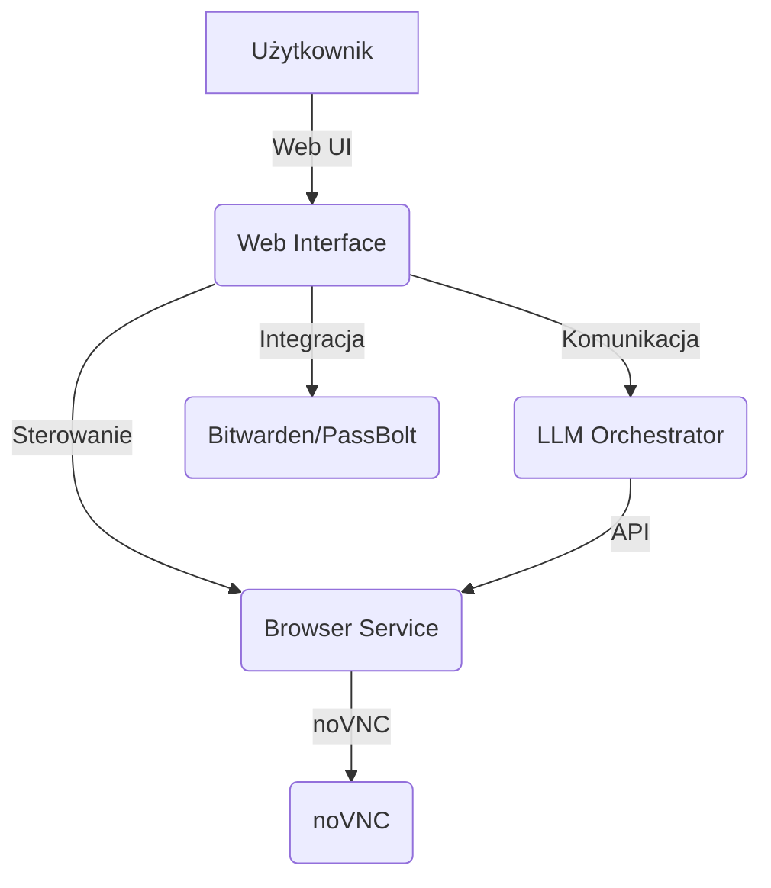
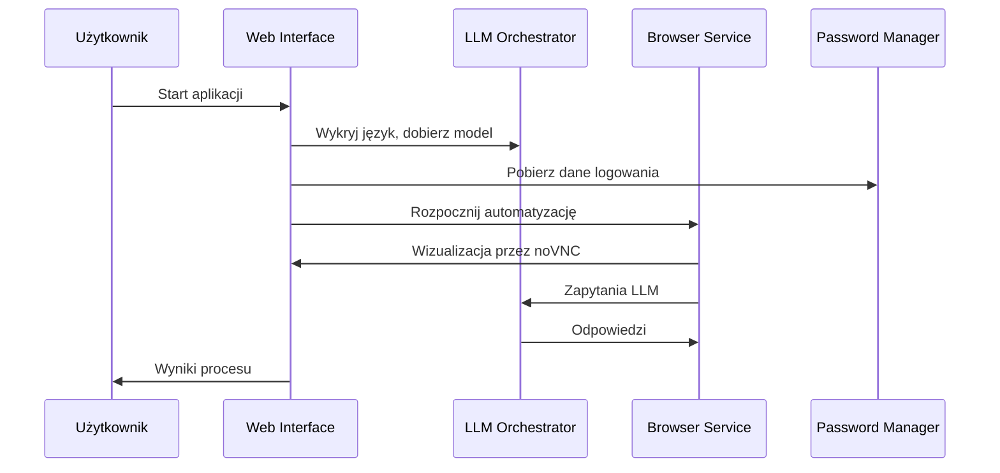

# Architektura coBoarding

```mermaid
flowchart TD
    U[Użytkownik] -->|Web UI| WI(Web Interface)
    WI -->|Sterowanie| BS(Browser Service)
    WI -->|Komunikacja| LLM(LLM Orchestrator)
    BS -->|noVNC| NV(noVNC)
    LLM -->|API| BS
    WI -->|Integracja| PW(Bitwarden/PassBolt)
```

*Diagram architektury systemu (Mermaid)*

---

```mermaid
sequenceDiagram
    participant U as Użytkownik
    participant WI as Web Interface
    participant LLM as LLM Orchestrator
    participant BS as Browser Service
    participant PW as Password Manager
    U->>WI: Start aplikacji
    WI->>LLM: Wykryj język, dobierz model
    WI->>PW: Pobierz dane logowania
    WI->>BS: Rozpocznij automatyzację
    BS->>WI: Wizualizacja przez noVNC
    BS->>LLM: Zapytania LLM
    LLM->>BS: Odpowiedzi
    WI->>U: Wyniki procesu
```

*Diagram przepływu działania (Mermaid)*
